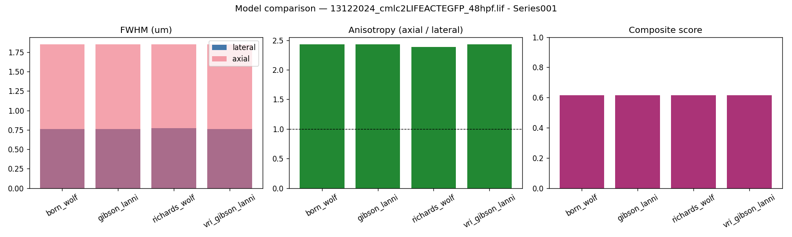
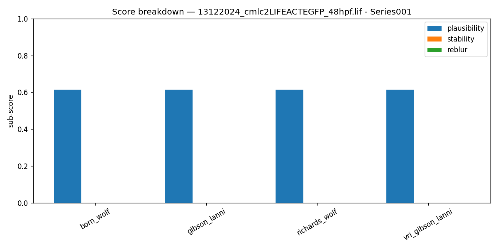
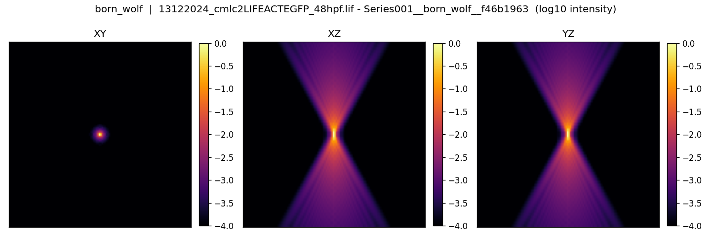
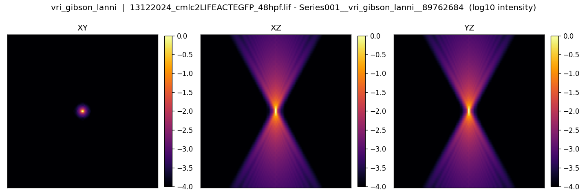

# PSF model selection report

Candidates evaluated: **4**  |  Models: born_wolf, gibson_lanni, richards_wolf, vri_gibson_lanni  |  Samples: 1

Scores are ground-truth-free indirect criteria in [0,1] (higher = better): **plausibility** (diffraction-theory & sampling consistency), **stability** (robustness to ±parameter perturbation), **reblur** (optional data-driven deconvolve→reblur consistency). **depth_sensitivity** is a diagnostic, not a quality score.

## Recommendations

### Sample: `13122024_cmlc2LIFEACTEGFP_48hpf.lif - Series001`

- **Recommended model:** `vri_gibson_lanni` — Variable-RI Gibson & Lanni (depth-dependent aberration)
- **Confidence:** low
- **Highest raw score:** `richards_wolf`
- **Escalation flags:** RI mismatch |ni-ns|=0.350 (>= 0.04)

**Reasoning:**
  - Default strategy starts from Gibson & Lanni: a robust scalar baseline that models stratified-media (coverslip/immersion/specimen) aberration.
  - Gibson & Lanni and Born & Wolf give near-identical axial FWHM (1.85 vs 1.85 um, 0% diff): stratified-media aberration is mild here, so Born & Wolf is an acceptable simpler baseline.
  - Depth/RI-mismatch indicators are triggered (see escalation flags): explore Variable-RI Gibson & Lanni, which models depth-dependent refractive-index aberration that the simpler models cannot capture.
  - Variable-RI Gibson & Lanni matches or beats the current pick (0.61 vs 0.61) under triggered depth/RI flags: recommend Variable-RI Gibson & Lanni.

## Ranked comparison table

|   rank_in_sample | sample_id                                       | model            | backend   |   fwhm_lateral_um |   fwhm_z_um |   anisotropy |   plausibility | stability   | reblur   | depth_sensitivity   |   composite |
|-----------------:|:------------------------------------------------|:-----------------|:----------|------------------:|------------:|-------------:|---------------:|:------------|:---------|:--------------------|------------:|
|                1 | 13122024_cmlc2LIFEACTEGFP_48hpf.lif - Series001 | richards_wolf    | psfmodels |             0.774 |       1.849 |         2.39 |          0.615 | —           | —        | —                   |       0.615 |
|                2 | 13122024_cmlc2LIFEACTEGFP_48hpf.lif - Series001 | born_wolf        | psfmodels |             0.761 |       1.85  |         2.43 |          0.614 | —           | —        | —                   |       0.614 |
|                2 | 13122024_cmlc2LIFEACTEGFP_48hpf.lif - Series001 | gibson_lanni     | psfmodels |             0.761 |       1.85  |         2.43 |          0.614 | —           | —        | —                   |       0.614 |
|                2 | 13122024_cmlc2LIFEACTEGFP_48hpf.lif - Series001 | vri_gibson_lanni | psfmodels |             0.761 |       1.85  |         2.43 |          0.614 | —           | —        | —                   |       0.614 |

## Figures

## Assumptions & caveats

- No measured (bead) PSF ground truth is used; rankings are *relative* and based on physical plausibility, stability and optional data consistency.
- Theoretical FWHM references use 0.51·λ/NA (lateral) and 1.77·n·λ/NA² (axial).
- Any optical fields missing from metadata were filled with documented defaults; check `metadata_resolved.json` for what was assumed per sample.
- If the EPFL PSF Generator JAR was unavailable, the psfmodels fallback backend was used (see the `backend` column). Born & Wolf is then approximated by a matched-RI scalar model and Variable-RI GL by a depth-adjusted specimen RI.